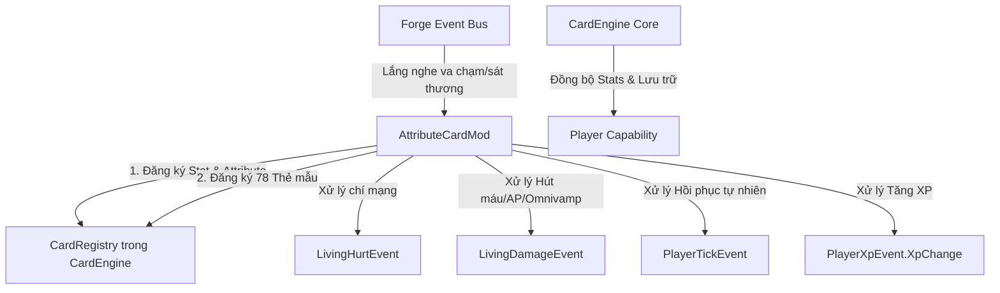

# System Map - Attribute Card Extension Reference Manual
*(Tài liệu tham chiếu thiết kế và hướng dẫn tích hợp dành cho Lập trình viên và AI Assistants)*

Tài liệu này mô tả chi tiết kiến trúc, các chỉ số, cơ chế và cấu trúc tệp tin của mod mở rộng **Attribute Card Extension** (`attribute_card_extension`). Đây là một extension chính thức cắm vào thư viện nền tảng **Card Engine** (`card_engine`), cung cấp hệ thống nâng cấp thuộc tính người chơi đa dạng.

---

## 1. Bản Đồ Thư Mục và Tệp Tin (Codebase File Map)

Để dễ dàng định vị các thành phần trong dự án `AtributeCardExtension`, dưới đây là các tệp tin cốt lõi và vai trò của chúng:

*   **Entrypoint & Lifecycle**:
    *   [AttributeCardMod.java](file:///d:/AMOD/AtributeCardExtension/src/main/java/com/example/examplemod/AttributeCardMod.java): Lớp chính (Main Class) của mod. Thực hiện đăng ký toàn bộ 13 cơ chế nâng cấp (mechanisms), tự động sinh 78 thẻ bài mẫu mặc định (13 chỉ số × 6 độ hiếm) thông qua vòng lặp, và lắng nghe các sự kiện gameplay của Forge.
*   **Configuration**:
    *   [Config.java](file:///d:/AMOD/AtributeCardExtension/src/main/java/com/example/examplemod/Config.java): Quản lý cấu hình phía máy chủ và máy trạm (Forge Config).
*   **Build & Metadata**:
    *   [build.gradle](file:///d:/AMOD/AtributeCardExtension/build.gradle): Cấu hình xây dựng dự án. Khai báo phụ thuộc vào `card_engine` dưới dạng deobfuscated jar thông qua `flatDir` (`libs/` folder). Thiết lập thư mục build đầu ra là `build_ext_new3` để tránh xung đột khóa tệp.
    *   `src/main/resources/META-INF/mods.toml`: Khai báo thông tin mod và bắt buộc tải sau `card_engine` (`ordering="AFTER"`).

---

## 2. Kiến Trúc & Luồng Dữ Liệu Tích Hợp (Integration Architecture Flow)



---

## 3. Danh Sách Chỉ Số & Cơ Chế Hoạt Động (Stats & Mechanics Detail)

Mod mở rộng này đăng ký tổng cộng **13 chỉ số nâng cấp**. Trong đó có **6 chỉ số** liên kết trực tiếp với Minecraft Attributes (được tự động áp dụng qua permanent `AttributeModifier` bởi CardEngine Core) và **7 chỉ số** được xử lý thông qua các sự kiện Forge tùy biến.

| Tên Chỉ Số (Stat Key) | Liên Kết Minecraft Attribute | Cơ Chế Hoạt Động | Biểu Tượng (Icon) |
| :--- | :--- | :--- | :--- |
| `max_health` | `Attributes.MAX_HEALTH` | Tăng máu tối đa của người chơi | `minecraft:apple` |
| `attack_damage` | `Attributes.ATTACK_DAMAGE` | Tăng sát thương vật lý cận chiến | `minecraft:iron_sword` |
| `attack_speed` | `Attributes.ATTACK_SPEED` | Tăng tốc độ đánh cận chiến | `minecraft:sugar` |
| `armor` | `Attributes.ARMOR` | Tăng giáp bảo vệ vật lý | `minecraft:iron_chestplate` |
| `magic_resist` | `Attributes.ARMOR_TOUGHNESS` | Tăng kháng ma thuật (Độ bền giáp) | `minecraft:shield` |
| `movement_speed` | `Attributes.MOVEMENT_SPEED` | Tăng tốc độ di chuyển | `minecraft:feather` |
| `ability_power` | *Không (Custom)* | Tăng sát thương phép thuật (Magic Damage) | `minecraft:blaze_rod` |
| `crit_chance` | *Không (Custom)* | Tỷ lệ gây gấp đôi sát thương vật lý | `minecraft:golden_sword` |
| `life_steal` | *Không (Custom)* | Hút máu cận chiến dựa trên sát thương gây ra | `minecraft:redstone` |
| `omnivamp` | *Không (Custom)* | Hút máu từ mọi nguồn sát thương gây ra | `minecraft:fermented_spider_eye` |
| `health_regen` | *Không (Custom)* | Hồi máu tự động mỗi 5 giây (100 ticks) | `minecraft:ghast_tear` |
| `ability_haste` | *Không (Custom)* | Chỉ số điểm hồi chiêu (Hỗ trợ mod phép thuật) | `minecraft:clock` |
| `bonus_xp` | *Không (Custom)* | Tăng lượng XP nhận được từ mọi nguồn | `minecraft:experience_bottle` |

### Chi Tiết Logic Xử Lý Các Sự Kiện Gameplay (Gameplay Event Logic)

1.  **Chí Mạng (Critical Strike - `crit_chance`)**:
    *   Lắng nghe sự kiện `LivingHurtEvent`.
    *   Nếu nguồn gây sát thương là người chơi thực hiện đòn đánh vật lý (`DamageTypes.PLAYER_ATTACK`), lấy tỷ lệ `crit_chance` tích lũy từ Capability của người chơi.
    *   Nếu kích hoạt thành công (ngẫu nhiên), nhân đôi sát thương nhận vào (`event.setAmount(doubleDamage)`) và gửi Component tin nhắn màu đỏ tươi hiển thị lượng sát thương chí mạng đã gây ra.
2.  **Hút Máu & Kháng Phép (Life Steal, Omnivamp & Ability Power)**:
    *   Lắng nghe sự kiện `LivingDamageEvent`.
    *   **Life Steal**: Nếu là sát thương cận chiến, hồi máu cho người chơi bằng: `Sát thương thực tế × tỷ lệ life_steal`.
    *   **Omnivamp**: Hồi máu cho người chơi từ mọi nguồn sát thương bằng: `Sát thương thực tế × tỷ lệ omnivamp`.
    *   **Ability Power**: Nếu nguồn sát thương là phép thuật (`DamageTypes.MAGIC` hoặc `INDIRECT_MAGIC`), tăng sát thương gây ra theo tỷ lệ: `Sát thương gốc × (1.0 + AP / 100.0)`.
3.  **Hồi Phục Tự Nhiên (HP Regen - `health_regen`)**:
    *   Lắng nghe sự kiện `TickEvent.PlayerTickEvent` ở phase `END`.
    *   Mỗi 100 ticks (5 giây), hồi lượng máu đúng bằng giá trị `health_regen` tích lũy thông qua phương thức `player.heal()`.
4.  **Tăng Thêm XP (Bonus XP - `bonus_xp`)**:
    *   Lắng nghe sự kiện `PlayerXpEvent.XpChange`.
    *   Tự động nhân thêm lượng XP nhận được dựa trên tỷ lệ phần trăm tích lũy: `Lượng XP mới = Lượng XP gốc × (1.0 + bonus_xp)`.

---

## 4. Cơ Chế Sinh Thẻ Tự Động (Automated Card Generation)

Để tránh việc phải viết tay hàng trăm dòng cấu hình JSON, `AttributeCardMod` tự động tạo ra **78 thẻ bài nâng cấp** mẫu ngay trong sự kiện `FMLCommonSetupEvent`:

*   Hệ thống chạy 2 vòng lặp lồng nhau qua 13 chỉ số và 6 cấp độ hiếm (`common`, `uncommon`, `rare`, `epic`, `legendary`, `mythic`).
*   Với mỗi thẻ nâng cấp được tạo ra:
    *   **Tên thẻ** được định danh theo định dạng: `[tên_chỉ_số]_[độ_hiếm]` (Ví dụ: `attribute_card_extension:crit_chance_epic`).
    *   **Giá trị nâng cấp** (`value`) tăng dần tuyến tính dựa theo cấp độ hiếm (Ví dụ: `max_health` tăng từ +1.0 HP ở Common lên +6.0 HP ở Mythic).
    *   **Mô tả thẻ** hiển thị rõ ràng giá trị được cộng thêm dưới dạng số thực hoặc phần trăm tương ứng.
*   Các thẻ bài này được gửi đến `CardRegistry.registerDefaultCard(card)`. Khi chạy game lần đầu, CardEngine sẽ quét và tự động xuất các tệp JSON cấu hình tương ứng vào thư mục `config/card_engine/cards/`. Người quản trị máy chủ hoàn toàn có thể vào các tệp này để tùy biến lại giá trị, mô tả hoặc icon mà không cần sửa code.

---

## 5. Hướng Dẫn Phát Triển & Biên Dịch (Developer & Compilation Guide)

### Thiết Lập Gradle
Mod mở rộng này phụ thuộc trực tiếp vào `card_engine`. Để biên dịch thành công, cần đặt tệp jar của thư viện `card_engine` vào thư mục `libs/` ở thư mục gốc của dự án `AtributeCardExtension`.

Tệp [build.gradle](file:///d:/AMOD/AtributeCardExtension/build.gradle) đã cấu hình flatDir để tự động nhận diện:
```groovy
repositories {
    flatDir {
        dir 'libs'
    }
}

dependencies {
    minecraft "net.minecraftforge:forge:${minecraft_version}-${forge_version}"
    implementation fg.deobf("card_engine:card_engine:1.0.0")
}
```

### Tránh Xung Đột Khóa Tệp Trên Windows
Để giải quyết triệt để lỗi khóa tệp `.class` do VS Code Java Language Server hoặc các IDE khác chiếm giữ khi build, tệp `build.gradle` sử dụng thuộc tính:
```groovy
layout.buildDirectory.set(file("build_ext_new3"))
```
Nếu bạn gặp lỗi `AccessDeniedException` trong quá trình clean hoặc compile, chỉ cần tăng số trong tên thư mục (ví dụ đổi thành `build_ext_new4`) để định tuyến lại thư mục xuất bản đầu ra của Gradle.
